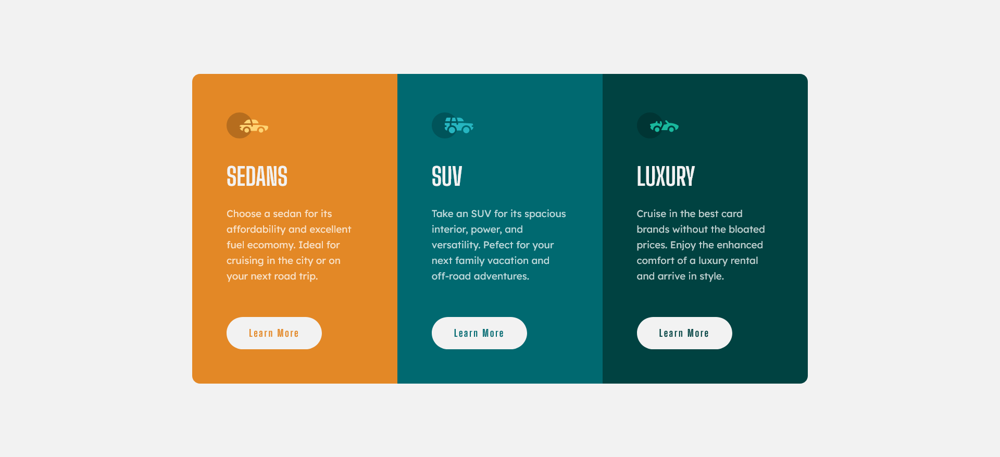

# Frontend Mentor - 3-column preview card component solution

This is a solution to the [3-column preview card component challenge on Frontend Mentor](https://www.frontendmentor.io/challenges/3column-preview-card-component-pH92eAR2-). Frontend Mentor challenges help you improve your coding skills by building realistic projects.

## Table of contents

- [Overview](#overview)
  - [The challenge](#the-challenge)
  - [Screenshot](#screenshot)
  - [Links](#links)
- [My process](#my-process)
  - [Built with](#built-with)
- [Author](#author)

## Overview

My challenge was to build out this 3-column preview card component and get it looking as close to the design as possible.

### The challenge

Users should be able to:

- View the optimal layout depending on their device's screen size
- See hover states for interactive elements

### Screenshot

### Links

- Solution URL: https://github.com/Gunner40/3-column-preview-card-component
- Live Site URL: https://gunner40.github.io/3-column-preview-card-component/ 

## My process

1. Study the design and make plan out the HTML structure and class names
2. Write the HTML
3. Write the CSS
4. Create a github repository and upload the files.
5. Deploy the project on the internet using github pages.
6. Submit solution to my frontend mentor profile.

### Built with

- Semantic HTML5 markup
- CSS custom properties
- Flexbox
- Mobile-first workflow

## Author

- Name - Paul Ryan
- Frontend Mentor - [@Gunner40](https://www.frontendmentor.io/profile/Gunner40)
